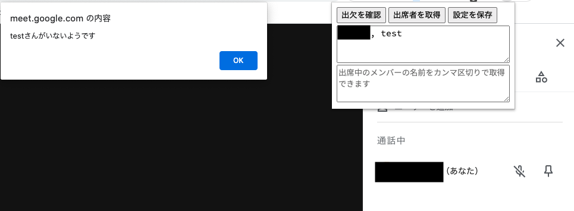

# これは何
Meetの出欠者確認を楽にするための拡張機能です。

MeetのURLごとに出席予定者の設定を保存できます。

# インストール方法
このリポジトリをダウンロードしてChromeの「その他」→「拡張機能」→「パッケージ化されていない拡張機能を読み込む」からディレクトリ（フォルダ）を選択して読み込むとインストールできます。

ブラウザ右上の拡張機能ボタンをクリックして「Attendance Checker」をピン留めすると、利用できるようになります。

# 使い方
- 通話中のメンバーを表示して右上の「A」をクリックすると、画像のようなポップアップが表示されます。
- 上のテキストエリアに参加者の名前を`,`区切りで入力して「出欠を確認」をクリックすると、出欠の確認が行えます。
  - Google Calenderの予定内から「ゲストのメールアドレスをコピー」してそのまま貼り付けても使えます
- 「出席者を取得」ボタンで下のテキストエリアに現在の出席者の名前がカンマ区切りで取得されます。
- 「設定を保存」ボタンを押すとそのMeetに紐づいた設定が保存されます。